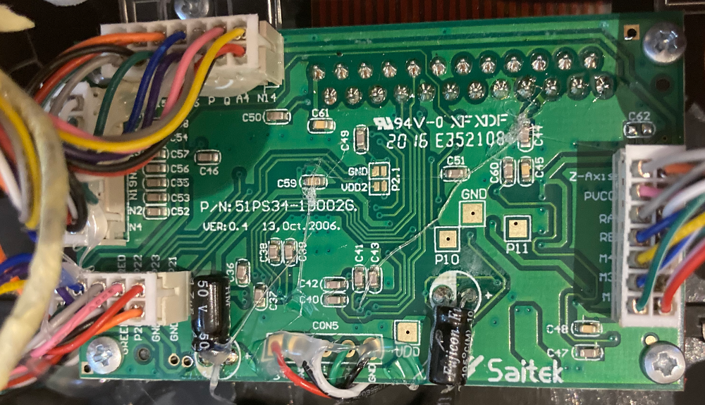
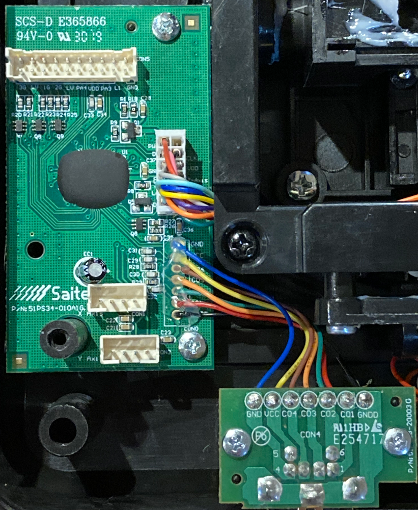
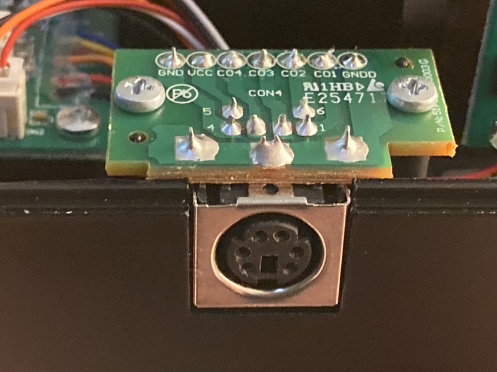
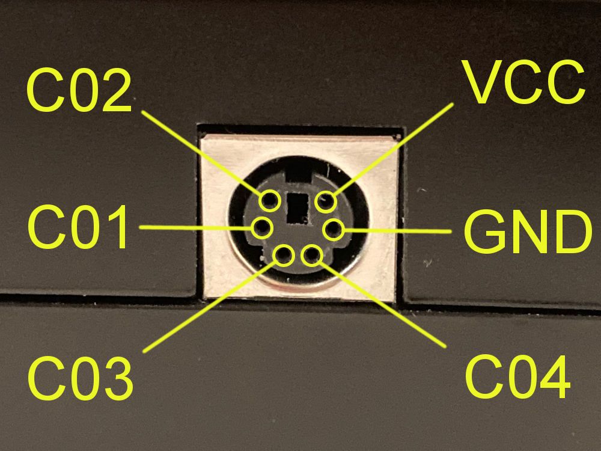
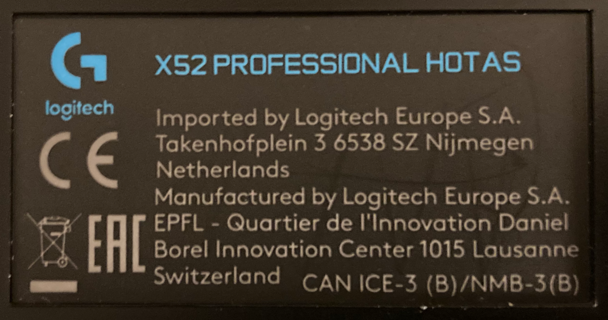
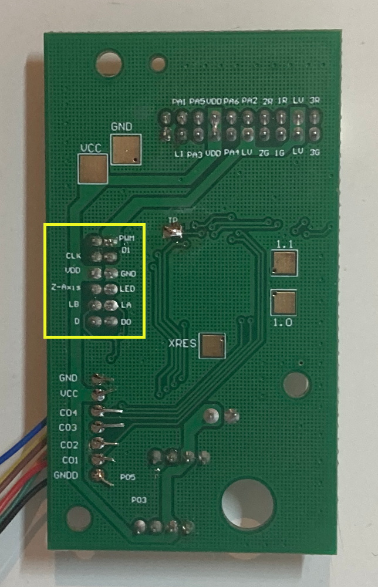

# The wire protocol between the X52 Pro throttle and joystick

## The Hardware

The X52 Pro has been around for a long time and the current hardware seems to be more or less the same as the decade old stuff: my unit was purchased new in June 2020 but the mainboard of the throttle says `VER:0.4  13,Oct.2006.`. This of course doesn't guarantee the absence of minor hardware/firmware differences between batches.

The mainboard of my X52 Pro throttle:

" )

The mainboard of my X52 Pro joystick:

The joystick handle contains 4 PCBs in total but I didn't disassemble it to take photos:

- In the middle where you grip the handle
- Under the POV 1, B and C buttons
- Under the POV 2, Fire and A buttons (the joystick's second MCU is located next to the Fire button)
- A tiny PCB dedicated to the rotary mode selector

This document and the provided Arduino sources refer to the pins of the PS/2 socket by the names printed on this PCB:

The pinout of the PS/2 female socket is the same on the joystick and the throttle:

- GND: ground
- VCC: positive supply voltage
- C01: data output of the throttle (GPIO)
- C02: clock output of the throttle (GPIO)
- C03: data output of the joystick (GPIO)
- C04: clock output of the joystick (GPIO)

The zeros in those pin names might actually be capital 'O' letters but the font used on the PCB makes them next to impossible to distinguish.

C01-C04 are connected directly to the GPIO pins of the throttle's and joystick's main MCUs. All of them have decoupling capacitors on both sides of the PS/2 cable and some have pulldown resistors too.

My X52 Pro throttle provides an odd 4.1-4.2V on VCC and uses the same voltage level on the digital pins (C01-C04). I power the joystick with 3.3V (VCC and digital pins) when I use it without the throttle. It might be compatible with 5V too but I didn't want to take risks and spend time on investigation.

The throttle uses a known MCU: [CY7C64215-56LTXC](https://www.cypress.com/file/134346). It has wide operating voltage range between 3V and 5V. Its digital input low and high levels are
about 0.8V and 2.1V respectively.

The C02 input pin of my X52 Pro joystick has extremely low impedance. I don't know if this is by design (in all production units) or partial (ESD) damage affecting only my joystick. My old X52 non-Pro joystick doesn't have this "issue". This has at least two important implications in my case:

- I can interface with my X52 Pro joystick's C02 input pin only using my teensy
  boards that have MCUs with low enough output pin impedance.
  I tried an ATmega32U4 based 3.3V board too but its output pins couldn't handle
  the joystick's low impedance C02 input pin (without additional external components).
  Your X52 Pro joystick may or may not have this issue.

- The current flowing through the C02 pin is relatively high (a few milliamps) instead of
  "almost zero" (micro- or nanoamps) that I'd expect from a general-purpose high impedance
  digital input pin. An update rate of 250 frames/sec results in a current of 4mA with the
  teensy 3.2 and about 6mA with the high drive pins of the teensy LC.
  The teensy 3.2 output pins are rated for 10mA while the teensy LC pins are rated for 5mA.
  [The teensy LC has four special high drive pins rated for 20mA: 5, 16, 17, 21.](https://www.pjrc.com/teensy/pinout.html)
  Connect the joystick's input pins (C01, C02) to those just to be on the safe side.

The label on the bottom of my X52 Pro joystick:

The label on the bottom of my X52 Pro throttle:

## The wire protocol over the PS/2 cable

The communication between the throttle and the joystick consists of frames that always have the same fixed size and structure. A frame transfers the joystick state (all sensors) to the throttle and the configuration (like LED brightness/colors) to the joystick.

Initial state (before/after/between frames): C02=0, C04=0. The values of the data lines (C01, C03) don't matter between frames - they are usually the values of the last data bits of the previous frame. The frames are initiated by the throttle with C02=1. The joystick is inactive and doesn't try to do anything while C02=0. The throttle polls the joystick periodically.

This is what a full frame looks like:

The X52 Pro throttle keeps the frame transmission request active (C02=1) between frames (in other words: it initiates the next frame immediately after the previous one but it isn't required to do so) and when the joystick responds (with that long C04=1 pulse at the beginning of the frame) it takes some time for the throttle to react probably because it is busy doing something else in the main loop of its firmware.

A frame consists of 76 clock cycles - the following sequence repeated 76 times:

- C02=1 (the throttle transitions to this state only after observing C04=0)
- C04=1 (the joystick transitions to this state only after observing C02=1)
- C02=0 (the throttle transitions to this state only after observing C04=1)
- C04=0 (the joystick transitions to this state only after observing C02=0)

The two clocks cooperate and can stretch each other. There are no strict timing requirements on individual clock signal transitions but there are some extremely generous frame transmission timeouts - more on that later.

The following diagram shows a full frame with the relative timings of the clock edges and data sampling. It's scalable vector graphics (SVG) so you can zoom in for the details:

The X52's firmware doesn't make the best use of the clocks and the available transmission lines. In theory it would be possible to transmit data in two directions in parallel and send 2 bits per cycle per data line. That could get the job done in 28-29 cycles instead of 76.

The joystick sends 56 bits of data over C03 as shown on the previously linked "clocking diagram". The throttle samples C03 between the falling edge of C04 and the subsequent rising edge of C02. This is what it looks like between the original throttle and joystick:

I implemented the fake joystick (the `ThrottleClient`) in a bit simpler way by putting data on C03 right before the rising edge of C04 and leaving it there until the next rising edge.

The throttle sends 19 bits of data over C01 as shown on the previously linked "clocking diagram". The joystick samples C01 between the rising edge of C02 and the subsequent rising edge of C04. This is what it looks like between the original throttle and joystick:

The joystick samples the desync detection bit under the yellow marker between falling-C02 and falling-C04 in clock cycle #56 of the frame. The 19 bits long joystick config data starts at the first rising edge of C02 on the screenshot.

### The structure of the transmitted data

The X52 Pro uses little endian bit order to transmit integers and this document follows that convention.

The structure of the 56 bits sent by the joystick over C03:

| Bit index/range | Description
| --------------- | -----------
| 0..7            | X-axis: least significant bits (unsigned little endian)
| 8..15           | Y-axis: least significant bits (unsigned little endian)
| 16..17          | X-axis: 2 most significant bits (unsigned little endian)
| 18..19          | Y-axis: 2 most significant bits (unsigned little endian)
| 20..21          | Seem to be unused (always zero)
| 22..23          | Z-axis: 2 most significant bits (unsigned little endian)
| 24..31          | Z-axis: least significant bits (unsigned little endian)
| 32..35          | POV 1 (unsigned little endian: 0000[0]=not pressed, 1000[1]=down, 0100[2]=down-right, 1100[3]=right, 0010[4]=up-right, 1010[5]=up, 0110[6]=up-left, 1110[7]=left, 0001[8]=down-left)
| 36              | POV 2 up (0=off, 1=on)
| 37              | POV 2 right (0=off, 1=on)
| 38              | POV 2 down (0=off, 1=on)
| 39              | POV 2 left (0=off, 1=on)
| 40              | Primary trigger stage 1 (0=off, 1=on)
| 41              | Safe fire button (0=off, 1=on)
| 42              | Button A (0=off, 1=on)
| 43              | Button C (0=off, 1=on)
| 44              | Primary trigger stage 2 (0=off, 1=on) (the stage 1 bit is also set when stage 2 is on)
| 45              | Rotary switch: mode 1 (0=off, 1=on)
| 46              | Rotary switch: mode 2 (0=off, 1=on)
| 47              | Rotary switch: mode 3 (0=off, 1=on)
| 48              | Button B (0=off, 1=on)
| 49              | Pinkie switch (0=off, 1=on)
| 50..55          | Buttons T1-T6 (0=off, 1=on)

Bits 45..47 can be all zeros when the rotary control is between two modes while switching.

The structure of the 19 bits sent by the throttle over C01:

| Bit index/range | Description
| --------------- | -----------
| 0..4            | LED brightness (unsigned little endian)
| 5               | POV 1 LED blinking (0=off, 1=on - blinks about 4 times per second)
| 6..7            | Button A LED color (little endian: 00=amber, 10=green, 01=red, 11=off)
| 8..9            | POV 2 LED color (little endian: 00=amber, 10=green, 01=red, 11=off)
| 10              | Fire button LED (0=on, 1=off)
| 11..12          | Button B LED color (little endian: 00=amber, 10=green, 01=red, 11=off)
| 13..14          | T1/T2 LED color (little endian: 00=amber, 10=green, 01=red, 11=off)
| 15..16          | T3/T4 LED color (little endian: 00=amber, 10=green, 01=red, 11=off)
| 17..18          | T5/T6 LED color (little endian: 00=amber, 10=green, 01=red, 11=off)

### Timeouts

I connected the X52 Pro joystick to a teensy (running fake throttle firmware) to test how it behaves when the throttle becomes unresponsive. After hacking a 100ms delay into the fake throttle's frame transmission loop:

If the throttle's clock stops ticking in the middle of a frame then the joystick times out about 23ms later. After the timeout the joystick forgets the failed frame and goes to C04=0 for about 2ms before trying to respond to the throttle's C02=1 request with C04=1. It seems that the joystick doesn't require a rising edge on C02 to treat C02=1 as a frame transmission request.

I tested the behaviour of the X52 Pro throttle with a similar method: connected it to a teensy (running fake joystick firmware) and hacked a 100ms delay into the joystick's frame transmission loop:

The throttle expects the whole frame to complete in ~17ms measured from the throttle's first falling edge on C02. After the timeout it forgets the failed frame and requests a new one (C02=1). It expects the joystick to respond with a rising edge on C04.

After the throttle's timeout there might be a period during which the throttle is unresponsive (even if it seems to have an active C02=1 request) but I couldn't see a clear pattern.

### Clock desync detection and correction

If something goes really wrong (once in a blue moon) then the clocks (C02 and C04) drift apart by one or more cycles. They are still ticking together and cooperate but the throttle and joystick assume different cycles to be the beginnings of the frames so they transmit invalid data to each other. A situation like that has to be detected and remedied somehow. The detection happens on the joystick side (in clock cycle #56 of the frame) using the "desync detection bit" and the remedy is forcing a throttle timeout by becoming unresponsive on the joystick side (by stopping the C04 clock) for a relatively long period (longer than the throttle timeout which is 17ms in my unit). After this ordeal both sides assume a clean start and the beginning of a new synchronised frame.

There is a problem with the way the throttle sends the 19 bits long joystick config over C01: the joystick samples/receives the data on C01 between rising-C02 and rising-C04 but a "180-degree phase later" C01 should be logical one between falling-C02 and falling-C04 in order to make the clock desync detection very reliable. The desync detection bit (between falling-C02 and falling-C04) should be logical one in all clock cycles except in cycle #56 of the frame because that's the only place where the joystick samples it and expects it to be zero (and becomes unresponsive for 23ms if it's a one).

I made some assumptions about the clock desync detection feature of the X52 Pro: the biggest assumption is that it exists. This is based on the observed behaviour of the joystick in clock cycle #56 of the frame. It may be an unintended behaviour or half-finished desync detection mechanism. If my assumptions are correct and your X52 Pro behaves like mine then you can enable the `X52_PRO_IMPROVED_JOYSTICK_CLIENT_DESYNC_DETECTION` and/or `X52_PRO_IMPROVED_THROTTLE_CLIENT_DESYNC_DETECTION` features in the provided Arduino library to make desync detection very reliable (100% instead of ~75%+) in the "fake throttle" and "fake joystick" firmwares. It's worth noting that clock desync usually doesn't happen during normal operation so the X52 probably works well for most people 99.99% of the time without any desync detection. Bad things can happen at the time of connecting the joystick to a powered-up throttle and also when the PS/2 cable is in an environment that introduces enough noise to the communication channels.

Below you can see two screenshots with and without the `X52_PRO_IMPROVED_JOYSTICK_CLIENT_DESYNC_DETECTION` feature. The fake throttle firmware transmits the exact same data (`1111001010010011110`) over C01 in both scenarios:

`X52_PRO_IMPROVED_JOYSTICK_CLIENT_DESYNC_DETECTION` is off:

`X52_PRO_IMPROVED_JOYSTICK_CLIENT_DESYNC_DETECTION` is on:

The first falling edge of C01 is where the desync detection bit (a zero) is placed on C01 in clock cycle #56 of the frame on both screenshots.

### Frame transmission rates

Four frames between the X52 Pro throttle and joystick:

It takes about 2ms for the throttle to respond (with C02=0) to the joystick's C04=1 and this is followed by the frame transmission that takes an additional 6-7ms. These values can be improved significantly by replacing the throttle with a faster device because the joystick is capable of transmitting at least 2-3 times more frames per second than the throttle.

Seven frames between the teensy 3.2 and the X52 Pro joystick:

The teensy can respond to the joystick's C04=1 immediately and the whole frame transmission takes a bit less than 2ms. The joystick is sometimes unresponsive for 1ms before the frame.

After limiting the frame rate to a maximum of 250 per sec (on the teensy side) with a method that aims to reduce jitter:

The unlimited frame rate between the teensy 3.2 and the X52 Pro joystick is fluctuating between 250 and 400 per second. It goes below 250 or above 400 quite rarely. It's 300-400 when the joystick is idle and only 250-300 when the buttons on the handle are under stress because there are 2 MCUs in the joystick - one in the base (on the mainboard) and one in the handle - and they have to communicate when the handle buttons are used.

The typical frame rate between the X52 Pro throttle and joystick is 100-125 (close to the typical HID USB poll rate). The min/max frame rates that I could consistently reproduce between the teensy 3.2 and the X52 Pro throttle are 90 and 165 per second. The teensy is, of course, very far from being the bottleneck. The actual number depends on the positions of the throttle's analogue controls and the LED colors/brightness.

Worst case scenario for the throttle - 90 frames per sec:

- The throttle/Z-axis, the two rotary controls and the slider are centered
- The mouse mini-stick has to point to bottom-left or bottom-right direction
- Max LED brightness with amber LED color

Best case scenario for the throttle - 165 frames per sec:

- The throttle/Z-axis, the two rotary controls and the slider are on min or max positions
- The mouse mini-stick is centered
- LEDs are turned off

# The wire protocol between the two MCUs of the joystick

There are 2 MCUs in the Pro joystick: one in the base (on the mainboard) and one in the handle (next to switch of the safe-fire button). The handle-MCU sends messages in an event-driven way only when the button states change. Similarly, the main-MCU sends messages only on config change (LED colors).

Exploring this part of the joystick was only a quick side mission so the related documentation doesn't go into details.

## The hardware

The pins that connect the handle's 11 wires to the mainboard of the X52 Pro joystick:

- CLK: digital output of the main-MCU (GPIO)
- D: digital output of the main-MCU (GPIO)
- D0: digital output of the handle-MCU (GPIO)
- D1: digital output of the handle-MCU (GPIO)
- GND: ground
- VDD: positive supply voltage
- PWM: controls the LED brightness
- Z-Axis: twist axis potentiometer
- LED: POV 1 LED
- LA: the green LED of button B
- LB: the red LED of button B

It seems that the POV 1 and button B LEDs are controlled directly by the main-MCU while all other LEDs and buttons of the handle are managed by the handle-MCU.

This document describes the protocol over the digital lines (CLK, D, D0, D1). I probed the analogue pins (like LED, LA and LB) without disassembling the handle. If you want to interface with those pins then you have to take apart the handle to explore the related circuits.

## The protocol

The protocol between the joystick's two MCUs is similar to the one between the throttle and the joystick: the frame based communication relies on two cooperating clock signals that can stretch each other. There are however some differences:

- Both the main-MCU and the handle-MCU can initiate frames and they do so in an event-driven way only when they have something new to send
- A frame transmits data only in one direction
- The frames initiated by the main-MCU and the handle-MCU differ in size, structure and direction of data transfer

Initial state (before/after/between frames): CLK=0, D=0, D0=0, D1=0. The main-MCU can request a new frame with CLK=1 (to transfer data in the main → handle direction). The handle-MCU can request a new frame with D0=1 (to transfer data in the handle → main direction).

### Messages sent by the main-MCU

The frames initiated by the main-MCU (with CLK=1) use the following three digital pins:

- CLK: clock output of the main-MCU
- D: data output of the main-MCU
- D1: clock output of the handle-MCU

The frame consists of 6 clock cycles - the following sequence repeated 6 times:

- CLK=1 (the main-MCU transitions to this state only after observing D1=0)
- D1=1 (the handle-MCU transitions to this state only after observing CLK=1)
- CLK=0 (the main-MCU transitions to this state only after observing D1=1)
- D1=0 (the handle-MCU transitions to this state only after observing CLK=0)

This is what a full frame looks like:

A frame transmits 5 bits of data to the handle (it's `11111` in the above example). The main-MCU puts the data bit on D right before the rising edge of CLK (except the first rising edge that isn't used for data transfer) and keeps it there until the next rising edge. At the end of the frame the main-MCU has to zero out both CLK and D: note that D is zeroed out exactly where the next (7th) rising edge of CLK would come: after the last (6th) falling edge of D1. I didn't investigate when exactly D is sampled by the handle-MCU (relative to the clock edges).

The structure of the 5 bit message is exactly the same as that of bits 6..10 of the messages sent over the C01 wire of the PS/2 cable (button A LED, POV 2 LED, Fire button LED).

### Messages sent by the handle-MCU

The frames initiated by the handle-MCU (with D0=1) use the following three digital pins:

- D0: clock output of the handle-MCU
- D1: data output of the handle-MCU
- D: clock output of the main-MCU

The frame consists of 21 clock cycles - the following sequence repeated 21 times:

- D0=1 (the handle-MCU transitions to this state only after observing D=0)
- D=1 (the main-MCU transitions to this state only after observing D0=1)
- D0=0 (the handle-MCU transitions to this state only after observing D=1)
- D=0 (the main-MCU transitions to this state only after observing D0=0)

This is what a full frame looks like:

A frame seems to transmit only 18 bits of useful data to the main-MCU (it's `100000000000000101` in the above example). The last two clock cycles of the frame always transmitted zeroes while I was probing. The handle-MCU puts the data bit on D1 right before the rising edge of D0 (except the first rising edge that isn't used for data transfer) and keeps it there until the next rising edge.

The structure of the 18 bit message is exactly the same as that of bits 32..49 of the messages sent over the C03 wire of the PS/2 cable.

### Any conflicts between the requests of the main-MCU and handle-MCU?

There are no serious conflicts between the requests of the main-MCU and the handle-MCU because CLK (that is used by the main-MCU to initiate a frame) isn't used by the frames initiated by the handle-MCU and similarly, D0 (that is used by the handle-MCU to initiate a frame) isn't used by the frames initiated by the main-MCU.

In a worst case scenario the two MCUs try to initiate their frames at the exact same time. This can be managed in many different ways (more or less sophisticated prioritisation methods) but I didn't investigate the MCUs' actual behaviour in that situation. The LED settings don't change often so the main-MCU sends its (low priority) messages rarely which means that conflicts must be extremely infrequent. For this reason I'd use a simple/primitive prioritisation method: different request timeout values on the main-MCU and the handle-MCU side. Lower timeout value on the main-MCU side because the messages of the handle-MCU are more important.

After power-up both MCUs start with sending the initial state to the other side:

On the above screenshot: After power-up the handle-MCU desperately tries to send its initial message but its requests (D0=1) time out probably because the main-MCU is still initializing. The timeout seems to be exactly 60ms. A gap (D0=0) after a timeout is 650µs long. Eventually the main-MCU responds and the handle-MCU successfully sends the message (that transmission ends at the 0ms mark). A bit later (after the 0ms mark) the main-MCU also sends its initial message to handle-MCU. The order probably isn't important. I didn't investigate the main-MCU's behaviour in case of unanswered frame transmission requests on CLK.
