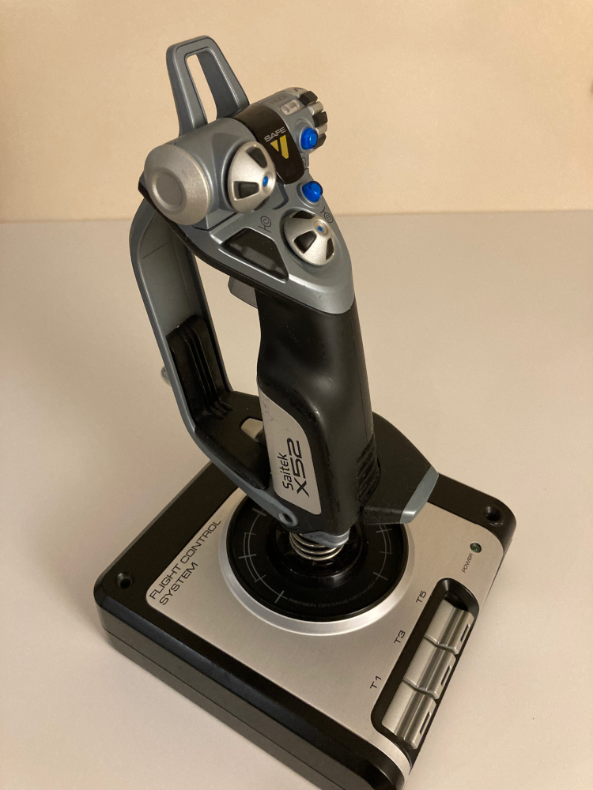
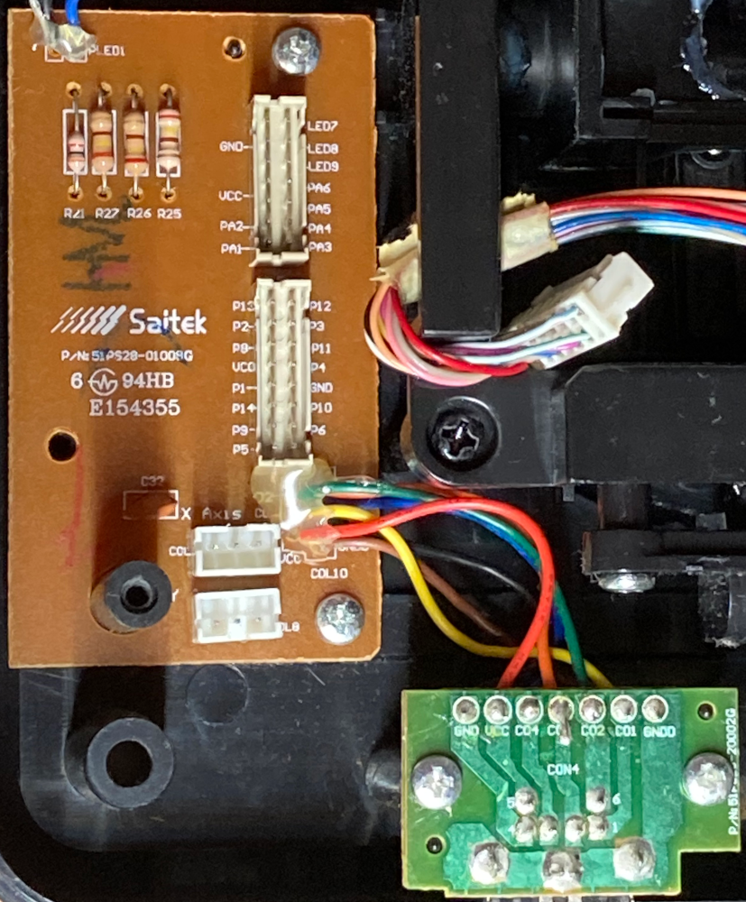
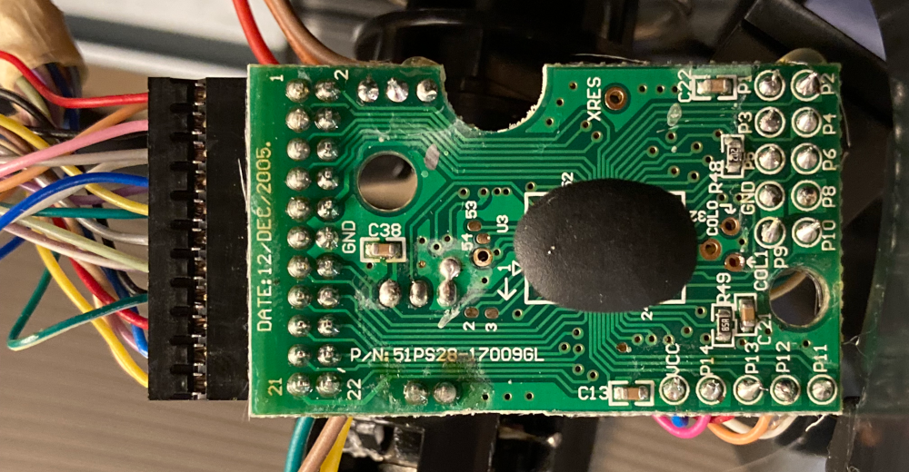
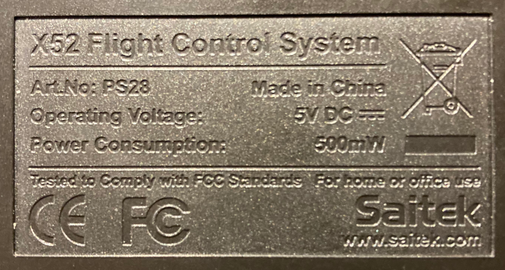

# The wire protocol between the X52 (non-Pro) throttle and joystick

## The Hardware

An old and worn X52 (non-Pro) joystick that has seen better days. It was sold for parts without the throttle and I picked it up because I wanted to see how it compares to the Pro version. The manufacture date is unknown just like the differences (if any) between this and today's new X52 units.

- The rubberised coating of the handle started to peel and sticking like glue on the hand-rest
- The Z-axis potentiometer is very jittery
- The T2 button is mushy

Everything else works, nothing unfixable. Self-centering is perfect on all 3 axes.

Inside the joystick's base:

The PCB contains only uninteresting connections:

Unlike the X52 Pro, this regular X52 has only one MCU that is located in the middle of the handle next to the Z-axis potentiometer (in the Pro version this PCB contains only connections):

The pinout of the PS/2 female socket is the same as that of my Pro throttle and joystick:

- GND: ground
- VCC: positive supply voltage
- C01: data output of the throttle (GPIO)
- C02: clock output of the throttle (GPIO)
- C03: data output of the joystick (GPIO)
- C04: clock output of the joystick (GPIO)

My X52 joystick isn't compatible with my X52 Pro throttle. They try to communicate but the attempts fail because they speak slightly different protocols.

The bottom of my X52 joystick:

The joystick claims to be 5V 500mW. It's happy with 3.3V too so I could pair it up with any of my Arduino-compatible boards without issues (3.3V and 5V boards running the "Fake X52 Throttle" firmware).

## How to reverse-engineer the wire protocol without an X52 throttle?

I didn't have an X52 throttle so couldn't just sniff and analyse the communication between that and the joystick but already had some experience with the X52 Pro's protocol and expected something similar after discovering that the PS/2 pinout is the same.

My X52 joystick was interrogated by sending a square wave to C02 (the throttle's clock) and zero bits to C01 (the throttle's data) hoping that it would be enough. It was enough: the joystick started to talk and spit out full frames to C03 and C04. The differences between the Pro and non-Pro protocols became obvious when I started to analyse the timings of the edges of the C02 and C04 clock signals:

- The choreography of the C02 and C04 clock signals
- Frame size
- The structure of the transmitted data

## The wire protocol over the PS/2 cable

The communication between the throttle and the joystick consists of frames that always have the same fixed size and structure. A frame transfers the joystick state (all sensors) to the throttle and the configuration (like LED brightness/colours) to the joystick.

Initial state (before/after/between frames): C02=0, C04=0. The values of the data lines (C01, C03) don't matter between frames - they are usually the values of the last data bits of the previous frame. The frames are initiated by the throttle with C02=1. The joystick is inactive and doesn't try to do anything while C02=0. The throttle polls the joystick periodically.

This is what a full frame looks like:

 and the X52 joystick" )

My Fake X52 Throttle implementation keeps the frame transmission request active (C02=1) between frames. In other words: it initiates the next frame immediately after the previous one but it isn't required to do so.

A frame consists of 72 clock cycles on C02 and 73 cycles on C04. These two clock signals cooperate and can stretch each other (except under the red and green markers on the above screenshot). This is the clock sequence of a full frame:

- Data transfer in the joystick → throttle direction (uses the C03 data line, C01 is ignored):

    - Frame transmission request from the throttle and response from the joystick:

        - C02=1 (the throttle should transition to this state only after observing C04=0, this transition isn't visible on the above screenshot)
        - C04=1 (the joystick transitions to this state only after observing C02=1 and seems to stay in this state for at least 15μs, this transition is under the red marker)
        - C04=0 (this transition is under the red marker)
        - C02=0 (the throttle transitions to this state only after observing the pulse on C04: C04=1 followed by C04=0)

    - Data transfer loop - the following sequence repeated 63 times:

        - C04=1 (the joystick transitions to this state only after observing C02=0)
        - C02=1 (the throttle transitions to this state only after observing C04=1)
        - C04=0 (the joystick transitions to this state only after observing C02=1)
        - C02=0 (the throttle transitions to this state only after observing C04=0)

- Data transfer in the throttle → joystick direction (uses the C01 data line, C03 is ignored):

    - A C04 pulse (the throttle has to wait for the end of this):

        - C04=1 (the joystick transitions to this state only after observing C02=0 and seems to stay in this state for at least 50μs, this transition is under the green marker)
        - C04=0 (this transition is under the green marker)

    - Data transfer loop - the following sequence repeated 8 times:

        - C02=1 (the throttle transitions to this state only after observing C04=0)
        - C04=1 (the joystick transitions to this state only after observing C02=1)
        - C02=0 (the throttle transitions to this state only after observing C04=1)
        - C04=0 (the joystick transitions to this state only after observing C02=0)

This is more complicated than the X52 Pro protocol but they are based on the same ideas. The extra complexity is introduced by the behaviour of the C04 signal under the red and green markers: C04 transitions twice (rising+falling edge) without waiting for the throttle's acknowledgement (a C02 transition before the falling edge of the C04 pulse). Catching a C04 pulse with a bitbanged wait-loop is unreliable so it's better done with an interrupt handler.

The following diagram shows a full frame with the relative timings of the clock edges and data sampling. It's scalable vector graphics (SVG) so you can zoom in for the details:

### Data transfer over C01 and C03

The joystick sends 64 bits of data over C03 as shown on the previously linked "clocking diagram". The throttle samples C03 between the falling edge of C04 and the subsequent falling edge of C02. How do I know this without having an X52 throttle? The only sensible alternative would be sampling between rising-C04 and rising-C02 but I noticed that the joystick sometimes removes the (logical one) data bit from C03 before the rising edge of C02. To consistently reproduce this I inserted/hacked a 25μs delay in front of the rising-C02 edges of my fake throttle and got the following result:

I implemented the fake joystick (the `ThrottleClient`) in a bit simpler way by putting data on C03 right before the rising edge of C04 and leaving it there until the next rising edge.

The throttle sends 8 bits of data over C01 as shown on the previously linked "clocking diagram". The joystick samples C01 between the rising edge of C02 and the subsequent rising edge of C04. This is what it looks like between my fake throttle and the original joystick:

The throttle sends `11111100` in the above example.

### The structure of the transmitted data

The X52 uses little endian bit order to transmit integers and this document follows that convention.

The structure of the 64 bits sent by the joystick over C03:

| Bit index/range | Description
| --------------- | -----------
| 0..7            | X-axis: least significant bits (unsigned little endian)
| 8..15           | Y-axis: least significant bits (unsigned little endian)
| 16..18          | X-axis: 3 most significant bits (unsigned little endian)
| 19..21          | Y-axis: 3 most significant bits (unsigned little endian)
| 22..23          | Z-axis: 2 most significant bits (unsigned little endian)
| 24..31          | Z-axis: least significant bits (unsigned little endian)
| 32..35          | POV 1 (unsigned little endian: 0000[0]=not pressed, 1000[1]=up, 0100[2]=up-right, 1100[3]=right, 0010[4]=down-right, 1010[5]=down, 0110[6]=down-left, 1110[7]=left, 0001[8]=up-left)
| 36              | POV 2 right (0=off, 1=on)
| 37              | POV 2 down (0=off, 1=on)
| 38              | POV 2 left (0=off, 1=on)
| 39              | POV 2 up (0=off, 1=on)
| 40              | Primary trigger stage 1 (0=off, 1=on)
| 41              | Primary trigger stage 2 (0=off, 1=on) (the stage 1 bit is also set when stage 2 is on)
| 42              | Safe fire button (0=off, 1=on)
| 43              | Button A (0=off, 1=on)
| 44              | Button B (0=off, 1=on)
| 45              | Button C (0=off, 1=on)
| 46              | Pinkie switch (0=off, 1=on)
| 47              | It's 1 only when the rotary switch is on mode 1
| 48..53          | Buttons T1-T6 (0=off, 1=on)
| 54..55          | Rotary switch (unsigned little endian: 00=["mode 1" if bit 47 is set otherwise "no mode selected"], 10=[mode 2], 01=[mode 3])
| 56..63          | Checksum byte (calculated by treating bits 0..55 as a byte array and XOR-ing together those 7 bytes)

The structure of the 8 bits sent by the throttle over C01:

| Bit index/range | Description
| --------------- | -----------
| 0..6            | LED brightness (unsigned little endian)
| 7               | POV 1 LED blinking (0=off, 1=on - blinks about 25 times per second)

### Timeouts

I hacked a 50ms delay into the fake throttle's frame transmission code to make it unresponsive in order to trigger the joystick's timeout:

Those C02=0 pulses are my 50ms long unresponsive delays and below them the C04=1 pulses show that the joystick's timeout is exactly 40ms. It is always measured from the point that is considered to be the beginning of the frame by the joystick (the first rising edge of C04 in the frame). After the timeout the joystick goes to C04=0 and becomes unresponsive to the throttle's C02=1 request for exactly ~478ms measured from the beginning of the failed frame.

During this experiment the joystick's LEDs were flashing (about two times per second). The LEDs are off while the joystick is in its unresponsive state.

My fake joystick implementation (the `ThrottleClient`) doesn't follow this behaviour very strictly: the unresponsive period is much shorter and measured from the point of timeout (just because the implementation is a tiny bit simpler this way).

### Frame transmission rates

I measured the frame rate using a teensy 3.2 (96MHz 3.3V ARM Cortex) and an Arduino Micro (16MHz 5V ATmega32U4) as the fake throttle. Frame transmission takes 1.5ms with the teensy 3.2 and 4ms with the Arduino Micro. This makes me assume that the joystick has an MCU as powerful as that of the X52 Pro joystick.

Unfortunately the firmware of my X52 joystick seems to have a hardcoded 17.5ms delay between frames. What a waste of clock cycles! You can see this on the following screenshot that shows the communication between the joystick and an Arduino Micro:

That 17.5ms delay has a huge negative impact on the max frame rate of the joystick:

| (Fake) Throttle                                                  | Frames Per Second
| ---------------------------------------------------------------- | -----------------
| Perfect/impossible throttle (with zero frame transmission time)  | 1000 / (17.5 + 0) = 57.1
| PJRC teensy 3.2                                                  | 1000 / (17.5 + 1.5) = 52.6
| Arduino Micro                                                    | 1000 / (17.5 + 4) = 46.5

### Clock desync detection and correction

Since I don't have an X52 throttle I don't know what happens between that and the joystick in case of a desync but I can explain how I solved that problem between my fake throttle and the joystick. Well, I solved it in theory but didn't spend time on testing the solution in practice as I don't have plans to use my non-Pro joystick.

Here is what we know:

- A frame between the fake throttle and the joystick usually takes less than 5ms
- The joystick is unresponsive for 17.5ms between successful frame transmissions
- The joystick times out if the frame transmission takes longer than 40ms

I solved the problem by setting the frame transmission timeout of the fake throttle carefully: 15ms. It isn't dangerously close to the average frame transmission time and it's less than the sum of the average frame transmission time (<5ms) and the joystick's unresponsive period (17.5ms).

If the clocks drift apart then the throttle or the joystick considers the frame finished a few cycles earlier than its peer:

- If the joystick finishes earlier then it begins its 17.5ms long unresponsive period. The throttle is still waiting for the last few clock cycles of the frame but times out well before the end of the joystick's long unresponsive period so the next frame starts with synchronised clocks.

- If the throttle finishes earlier then the story becomes a bit more complicated because the joystick has a very long 40ms frame transmission timeout. The throttle starts the next frame well before the joystick's 40ms timeout so the joystick uses the first few clock cycles of next frame as the last cycles of the previous frame. When the joystick considers the previous frame finished (thanks to the wasted cycles of the next frame) it goes into a 17.5ms long unresponsive period. The throttle thinks that it's in the middle of the next frame and times out before the end of the joystick's unresponsive period (just like in the previously discussed scenario) so the next frame starts with synchronised clocks.

The situation may be a bit more complicated due to the behaviour of the C04 clock signal in cycles #00 and #64 of the frame. If the throttle expects two C04 transitions but observes only one (as a result of desync) then a timeout may happen earlier than I expected.
